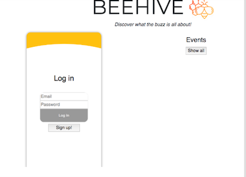
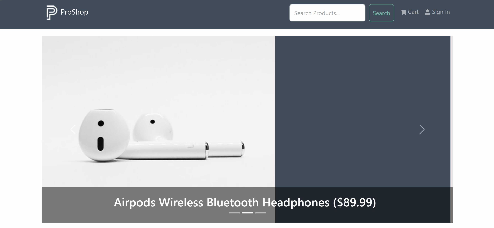

# Codebase Improvement Suggestions

## 🔒 Security Issues

### 1. **Outdated CDN Links**
- **Issue**: Using deprecated `rawgit.com` CDN (line 32) - this service is no longer maintained
- **Fix**: Replace with `cdn.jsdelivr.net` or `unpkg.com`
  ```html
  <!-- Current (deprecated) -->
  <link rel="stylesheet" href="https://cdn.rawgit.com/konpa/devicon/df6431e323547add1b4cf45992913f15286456d3/devicon.min.css">
  
  <!-- Recommended -->
  <link rel="stylesheet" href="https://cdn.jsdelivr.net/gh/devicons/devicon@latest/devicon.min.css">
  ```

### 2. **Outdated jQuery Version**
- **Issue**: Using jQuery 2.1.3 (2014) - has known security vulnerabilities
- **Fix**: Update to jQuery 3.7.1 or later
  ```html
  <script src="https://code.jquery.com/jquery-3.7.1.min.js"></script>
  ```

### 3. **Outdated Font Awesome**
- **Issue**: Using Font Awesome 4.7.0 (2017) - outdated
- **Fix**: Update to Font Awesome 6.x or use a more modern icon library

### 4. **Missing Meta Tags for Security**
- **Fix**: Add security headers
  ```html
  <meta http-equiv="X-Content-Type-Options" content="nosniff">
  <meta http-equiv="X-Frame-Options" content="DENY">
  <meta http-equiv="X-XSS-Protection" content="1; mode=block">
  ```

## ⚡ Performance Improvements

### 5. **Image Optimization**
- **Issue**: Images not optimized, missing `loading="lazy"` attribute
- **Fix**: 
  - Add lazy loading to images below the fold
  - Compress images (use WebP format where possible)
  - Add proper `width` and `height` attributes to prevent layout shift
  ```html
  
  ```

### 6. **CSS/JS Minification**
- **Issue**: CSS and JS files not minified for production
- **Fix**: Add build process to minify CSS/JS
  ```json
  "scripts": {
    "build": "npm run minify-css && npm run minify-js",
    "minify-css": "cssnano css/main.css css/main.min.css",
    "minify-js": "uglifyjs js/main.js -o js/main.min.js"
  }
  ```

### 7. **Remove Unused CSS**
- **Issue**: Large CSS files with potentially unused styles
- **Fix**: Use tools like PurgeCSS to remove unused CSS

### 8. **Font Loading Optimization**
- **Issue**: Fonts loaded synchronously, blocking render
- **Fix**: Use `font-display: swap` and preload critical fonts
  ```html
  <link rel="preload" href="fonts/poppins/poppins-regular-webfont.woff2" as="font" type="font/woff2" crossorigin>
  ```

## 🎨 Code Quality & Best Practices

### 9. **HTML5 Semantic Improvements**
- **Issue**: Missing semantic HTML5 elements
- **Fix**: Use `<main>`, `<article>`, `<aside>` where appropriate
  ```html
  <main>
    <section id="about">...</section>
    <section id="portfolio">...</section>
  </main>
  ```

### 10. **Consistent Image Paths**
- **Issue**: Mixed use of absolute (`/images/`) and relative (`images/`) paths
- **Fix**: Use consistent relative paths throughout
  ```html
  <!-- Current (inconsistent) -->
  
  
  
  <!-- Recommended -->
  
  
  ```

### 11. **Remove Commented Code**
- **Issue**: Large blocks of commented-out code (lines 120-123, 346-348, 456-458, etc.)
- **Fix**: Remove commented code or move to version control history

### 12. **Fix HTML Structure Issues**
- **Issue**: 
  - Empty `skills-details` div (lines 325-331)
  - Broken contact section structure (lines 790-799)
  - Nested modals incorrectly (modal-02 contains modal-03 and modal-04)
- **Fix**: Clean up HTML structure, fix nesting

### 13. **JavaScript Modernization**
- **Issue**: Using deprecated jQuery methods like `$(window).load()`
- **Fix**: 
  ```javascript
  // Old
  $(window).load(function() { ... });
  
  // New
  $(window).on('load', function() { ... });
  // Or better, use vanilla JS
  window.addEventListener('load', function() { ... });
  ```

### 14. **Consistent GitHub Username**
- **Issue**: Mixed GitHub usernames (`mahelet-kassa` vs `mk1366`)
- **Fix**: Use consistent username throughout

## ♿ Accessibility Improvements

### 15. **Missing Alt Text Quality**
- **Issue**: Some images have generic alt text
- **Fix**: Add descriptive alt text
  ```html
  
  ```

### 16. **ARIA Labels**
- **Issue**: Missing ARIA labels for interactive elements
- **Fix**: Add ARIA labels for better screen reader support
  ```html
  <button aria-label="Close modal" class="popup-modal-dismiss">Close</button>
  <nav aria-label="Main navigation">
  ```

### 17. **Keyboard Navigation**
- **Issue**: Modal close buttons may not be keyboard accessible
- **Fix**: Ensure all interactive elements are keyboard accessible

### 18. **Color Contrast**
- **Issue**: Need to verify color contrast ratios meet WCAG AA standards
- **Fix**: Test and adjust colors if needed (especially in skills section overlay)

### 19. **Focus Indicators**
- **Issue**: May be missing visible focus indicators
- **Fix**: Ensure all focusable elements have visible focus states

## 🔍 SEO Improvements

### 20. **Meta Description**
- **Issue**: Empty meta description (line 12)
- **Fix**: Add compelling meta description
  ```html
  <meta name="description" content="Mahelet Kassa - Full Stack Software Engineer based in Boston. Specializing in React, Angular, Java, Spring Boot, AWS, and cloud architecture.">
  ```

### 21. **Open Graph Tags**
- **Issue**: Missing Open Graph tags for social media sharing
- **Fix**: Add Open Graph meta tags
  ```html
  <meta property="og:title" content="Mahelet Kassa - Full Stack Software Engineer">
  <meta property="og:description" content="...">
  <meta property="og:image" content="https://maheletkassa.com/images/Mahi-profile.jpg">
  <meta property="og:url" content="https://maheletkassa.com">
  ```

### 22. **Structured Data**
- **Issue**: Missing JSON-LD structured data
- **Fix**: Add structured data for Person/Professional profile
  ```html
  <script type="application/ld+json">
  {
    "@context": "https://schema.org",
    "@type": "Person",
    "name": "Mahelet Kassa",
    "jobTitle": "Full Stack Software Engineer",
    "url": "https://maheletkassa.com"
  }
  </script>
  ```

### 23. **Canonical URL**
- **Issue**: Missing canonical URL
- **Fix**: Add canonical link
  ```html
  <link rel="canonical" href="https://maheletkassa.com/">
  ```

## 📱 Mobile & Responsive

### 24. **Viewport Meta Tag Enhancement**
- **Issue**: Basic viewport tag
- **Fix**: Add more specific viewport settings
  ```html
  <meta name="viewport" content="width=device-width, initial-scale=1.0, maximum-scale=5.0, user-scalable=yes">
  ```

### 25. **Touch Target Sizes**
- **Issue**: Some buttons/links may be too small for touch
- **Fix**: Ensure minimum 44x44px touch targets

## 🛠️ Modern Development Practices

### 26. **Add .gitignore**
- **Issue**: No `.gitignore` file visible
- **Fix**: Create `.gitignore` to exclude:
  ```
  node_modules/
  .DS_Store
  *.log
  .env
  dist/
  build/
  ```

### 27. **Environment Variables**
- **Issue**: Hardcoded email addresses and URLs
- **Fix**: Use environment variables for configuration

### 28. **Add Build Tools**
- **Issue**: No modern build process
- **Fix**: Consider adding:
  - Webpack or Vite for bundling
  - PostCSS for CSS processing
  - Babel for JavaScript transpilation

### 29. **TypeScript Migration**
- **Suggestion**: Consider migrating JavaScript to TypeScript for better type safety

### 30. **Component-Based Architecture**
- **Suggestion**: Consider refactoring to a component-based framework (React, Vue) for better maintainability

## 📊 Analytics & Monitoring

### 31. **Add Analytics**
- **Issue**: No analytics tracking
- **Fix**: Add Google Analytics or similar
  ```html
  <!-- Google Analytics -->
  <script async src="https://www.googletagmanager.com/gtag/js?id=GA_MEASUREMENT_ID"></script>
  ```

### 32. **Error Tracking**
- **Suggestion**: Add error tracking (Sentry, LogRocket)

## 🎯 Content Improvements

### 33. **Update Copyright Year**
- **Issue**: Copyright shows "2019" (line 840)
- **Fix**: Update to current year or use dynamic year
  ```html
  <span>Mahelet Kassa <script>document.write(new Date().getFullYear())</script></span>
  ```

### 34. **Fix Typos**
- **Issue**: "Messiah Collage" should be "Messiah College" (line 726)
- **Fix**: Correct spelling throughout

### 35. **Skills Section Empty Content**
- **Issue**: Empty `skills-details` div (lines 325-331)
- **Fix**: Either remove it or add the categorized skills content that was removed

## 🚀 Quick Wins (High Priority)

1. ✅ Fix deprecated CDN links (rawgit → jsdelivr)
2. ✅ Update jQuery to latest version
3. ✅ Add proper meta description
4. ✅ Fix inconsistent image paths
5. ✅ Remove commented code
6. ✅ Fix HTML structure issues (contact section, nested modals)
7. ✅ Add lazy loading to images
8. ✅ Update copyright year
9. ✅ Fix typos (Messiah College)
10. ✅ Add Open Graph tags

## 📝 Documentation

### 36. **Code Comments**
- **Issue**: Some complex logic lacks comments
- **Fix**: Add JSDoc comments to JavaScript functions

### 37. **README Enhancement**
- **Suggestion**: Add more details about:
  - Development workflow
  - Deployment process
  - Contributing guidelines
  - Known issues

## 🔄 Maintenance

### 38. **Dependency Updates**
- **Issue**: Outdated dependencies
- **Fix**: Regularly update dependencies using `npm audit` and `npm outdated`

### 39. **Browser Testing**
- **Suggestion**: Test on multiple browsers and devices
- **Fix**: Add browser testing to CI/CD pipeline

### 40. **Performance Monitoring**
- **Suggestion**: Use Lighthouse CI to monitor performance metrics
- **Fix**: Set up automated performance testing

---

## Implementation Priority

**Critical (Do First):**
- Security updates (CDN, jQuery)
- Fix HTML structure issues
- Add meta description
- Fix image paths

**High Priority:**
- Performance optimizations (lazy loading, image optimization)
- Accessibility improvements
- SEO enhancements

**Medium Priority:**
- Code cleanup (remove comments, fix structure)
- Modern JavaScript practices
- Build process improvements

**Low Priority (Nice to Have):**
- Framework migration
- Advanced analytics
- TypeScript migration

---

*Last Updated: 2024*

